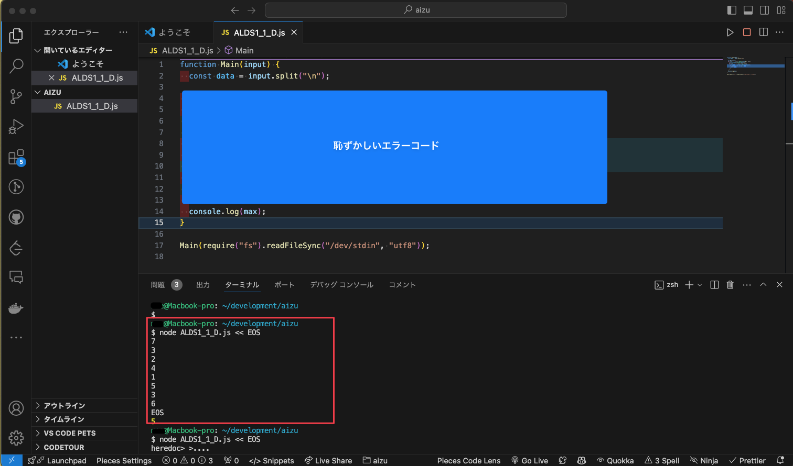
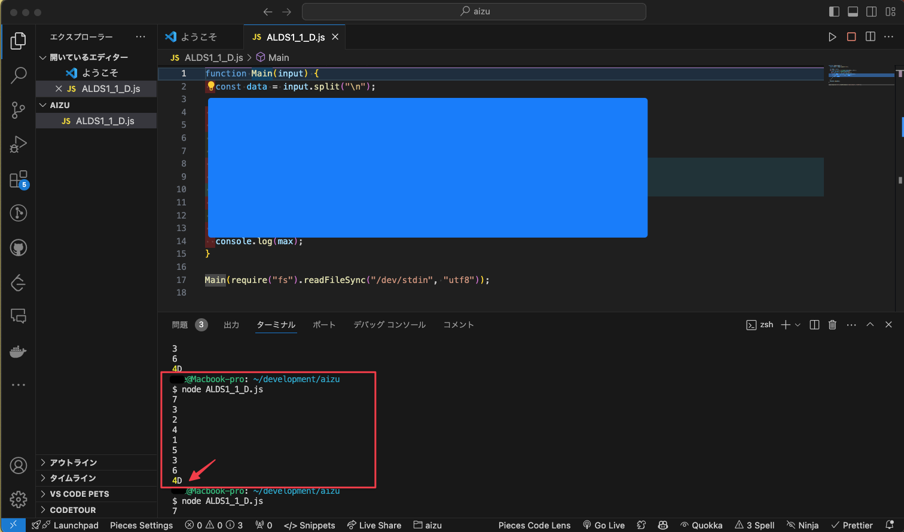

アルゴリズムの勉強のため、AIZU ONLINE JUDGEを始めて使おうとしたら、提出前コードをVSCodeでテストするのに標準入力の受け取り方が分からなかったので、メモ。

## 環境
Mac
zsh

### プログラム
ファイル名(実行例): main.js
```javascript
function Main(input) {
  const data = input.split("\n");

  《略》
  console.log(hoge);
}

Main(require("fs").readFileSync("/dev/stdin", "utf8"));
```

※標準入力のコードは　https://yukicoder.me/wiki/stdio　を参考にしました。


### 実行と標準入力の受け取り
```zsh
node main.js <<EOF
1 2
3 4
EOF
```
EOFで囲んだ内部に標準入力の内容を入力したりコピペする。
（他の方法でもやったのですが、入力値以外の文字情報もなぜか受け取ってしまってエラーになることがありました）

### スクショ
成功例


失敗例

入力文字(input変数)に余計な文字列が入ってしまっている。

## 参考
https://yukicoder.me/wiki/stdio
https://qiita.com/take4s5i/items/e207cee4fb04385a9952
